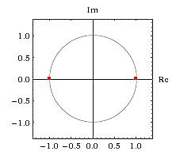
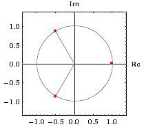
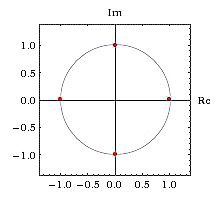
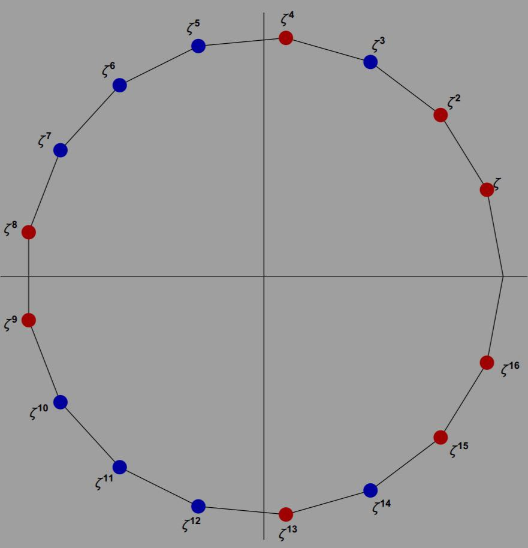
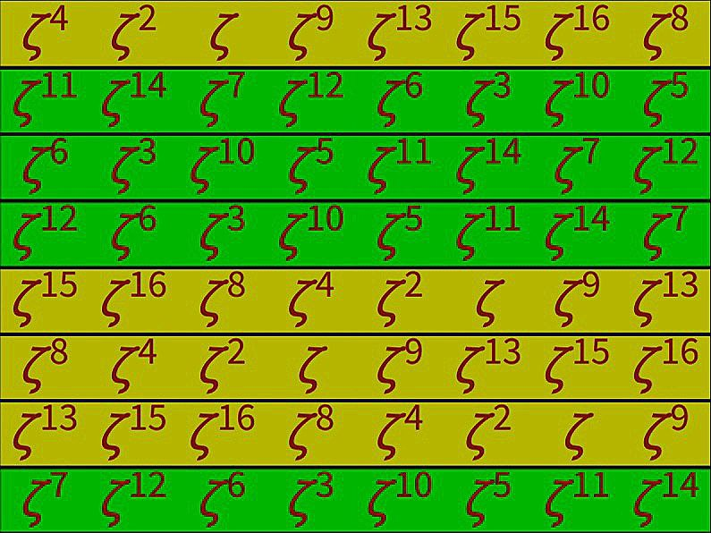

# Roots of unity

This article extends [https://github.com/Z323323/Complex-numbers-background/tree/main].

Wiki reports _"a root of unity is any complex number that yields 1 when raised to some positive integer power n"_.

This means that the roots of unity are the solutions to this kind of equations:

$z^{n} = 1$

or equivalently

$z^{n} - 1 = 0$

$->$ 
$z = \sqrt[n]{1}$

## Cyclotomic equations

  The equations mentioned previously are called cyclotomic equations, and it's quite simple to derive the equivalent form

  $x^{n} - 1 = (x - 1)(x^{n - 1} + x^{n - 2} + \dots + 1) = 0$

 Since I basically followed the entire course at [https://crypto.stanford.edu/pbc/notes/numbertheory/] let's follow [https://crypto.stanford.edu/pbc/notes/numbertheory/cyclo.html] for the moment. This section is made for completeness purposes mostly. Solving these kind of equations is in general a challenging math game, so, for the moment, we will find the solutions for $n = 1, 2, 3, 4$ and $5$ using the most elementary methods (such as [https://github.com/Z323323/Quadratic-formula-derivation]). It's possible to find solutions even for $n \gt 5$ but it's hard, and in general the $n = 5$ case already show pretty clearly that the quadratic formula is not the way to go, especially for $n$ $odd$ (we are interested in primes mostly by the way).

 $n = 1$ 
 $->$ 
 $x = 1$

 $---$

 $n = 2$ 
 $->$ 
 $x^{2} = 1$ 
 $->$ 
 $\sqrt{x} = 1$ 
 $->$ 
 $x = \pm 1$ 
 $->$ 
 $x_1 = 1$ 
 $x_2 = - 1$

 $---$

 $n = 3$ 
 $->$ 
 $x^{3} - 1 = 0$ 
 $->$ 
 $(x - 1)(x^{2} + x + 1) = 0$ 
 $->$ 
 $x_1 = 1$ 
 $and$ 
 $\displaystyle x_{2,3} = \frac{- 1 \pm \sqrt{1 - 4}}{2}$ 
 $->$ 
 $\displaystyle x_2 = \frac{- 1 + i\sqrt{3}}{2}$ 
 $\displaystyle x_3 = \frac{- 1 - i\sqrt{3}}{2}$

 $---$

 $n = 4$ 
 $->$ 
 $x^{4} - 1 = 0$ 
 $->$ 
 $(x - 1)(x + 1)(x^{2} + 1) = 0$ 
 $->$ 
 $x_1 = 1$ 
 $x_2 = - 1$ 
 $and$ 
 $x^{2} + 1 = 0$ 
 $->$ 
 $x_{3, 4} = \pm \sqrt{- 1}$ 
 $->$ 
 $x_3 = i$ 
 $x_4 = - i$

 $---$

 $n = 5$ 
 $->$ 
 $x^{5} - 1 = 0$ 
 $->$ 
 $(x - 1)(x^{4} + x^{3} + x^{2} + x + 1) = 0$ 
 $->$ 
 $x_1 = 1$ 
 $and$ 
 $x^{4} + x^{3} + x^{2} + x + 1 = 0$ 
 $->$ 
 $\displaystyle x^{2} + x + 1 + \frac{1}{x} + \frac{1}{x^{2}} = 0$ 
 $->$ 
 $\displaystyle (x + \frac{1}{x})^{2} = x^{2} + 2 + \frac{1}{x^{2}}$ 
 $->$ 
 $\displaystyle x^{2} + x + 1 + \frac{1}{x} + \frac{1}{x^{2}} = (x + \frac{1}{x})^{2} + (x + \frac{1}{x}) - 1$ 
 $->$ 
 $\displaystyle y = x + \frac{1}{x}$ 
 $->$ 
 $\displaystyle (x + \frac{1}{x})^{2} + (x + \frac{1}{x}) - 1 = y^{2} + y - 1 = 0$ 
 $->$ 
 $y^{2} + y - 1 = 0$ 
 $->$ 
 $\displaystyle y_{1,2} = \frac{- 1 \pm \sqrt{5}}{2}$ 
 $->$ 
 $\displaystyle y = x + \frac{1}{x}$ 
 $->$ 
 $\displaystyle yx = x^{2} + 1$ 
 $->$ 
 $\displaystyle x^{2} - yx + 1 = 0$ 
 $->$ 
 $\displaystyle x_{2,3,4,5} = \frac{y \pm \sqrt{y^{2} - 4}}{2} = \frac{\frac{- 1 \pm \sqrt{5}}{2} \pm \sqrt{(\frac{- 1 \pm \sqrt{5}}{2})^{2} - 4}}{2} = \frac{\pm \sqrt{5} - 1}{4} \pm \frac{\sqrt{(\frac{- 1}{2} \pm \frac{\sqrt{5}}{2})^{2} - 4}}{2} = \frac{\pm \sqrt{5} - 1}{4} \pm \frac{\sqrt{\frac{1}{4} \pm (\frac{5}{4} - \frac{\sqrt{5}}{2}) - 4}}{2}$ 
 $\displaystyle x_{2,3} = \frac{\sqrt{5} - 1}{4} \pm \frac{\sqrt{\frac{1}{4} + \frac{5}{4} - \frac{\sqrt{5}}{2} - 4}}{2} = \frac{\sqrt{5} - 1}{4} \pm \frac{\sqrt{\frac{1}{4} + \frac{5}{4} - \frac{2\sqrt{5}}{4} - \frac{16}{4}}}{2} = \frac{\sqrt{5} - 1}{4} \pm \frac{\sqrt{1 + 5 - 2\sqrt{5} - 16}}{4} = \frac{\sqrt{5} - 1 \pm \sqrt{- 2\sqrt{5} - 10}}{4}$ 
 $\displaystyle x_{4,5} = \frac{- \sqrt{5} - 1}{4} \pm \frac{\sqrt{\frac{1}{4} + \frac{5}{4} + \frac{\sqrt{5}}{2} - 4}}{2} = \frac{- \sqrt{5} - 1}{4} \pm \frac{\sqrt{\frac{1}{4} + \frac{5}{4} + \frac{2\sqrt{5}}{4} - \frac{16}{4}}}{2} = \frac{- \sqrt{5} - 1}{4} \pm \frac{\sqrt{1 + 5 + 2\sqrt{5} - 16}}{4} = \frac{- \sqrt{5} - 1 \pm \sqrt{2\sqrt{5} - 10}}{4}$ 
 
If you made it this far you'll agree with me that this is not the way to go to compute roots of unity, even though this is a great exercise. Also, we will need to find a way to make these complex solutions to work on multiplicative groups, since the numbers obtained in complex form still don't help us.

The last example for $n = 5$ is quite interesting though, since it seems there are no complex solutions involved, while if you look at the next section it will be quite simple to understand that the $4$ non-trivial solutions we derived can't be considered completely real, that is, if you follow through you'll find 

$\displaystyle x_2 = e^{\frac{2i\pi}{5}}$ 
$\displaystyle x_3 = e^{\frac{4i\pi}{5}}$ 
$\displaystyle x_4 = e^{\frac{6i\pi}{5}}$ 
$\displaystyle x_5 = e^{\frac{8i\pi}{5}}$

thus

$\displaystyle x_2 = \cos(\frac{2i\pi}{5}) + i\sin(\frac{2i\pi}{5})$ 
$\displaystyle x_3 = \cos(\frac{4i\pi}{5}) + i\sin(\frac{4i\pi}{5})$ 
$\displaystyle x_4 = \cos(\frac{6i\pi}{5}) + i\sin(\frac{6i\pi}{5})$ 
$\displaystyle x_5 = \cos(\frac{8i\pi}{5}) + i\sin(\frac{8i\pi}{5})$

which are not real numbers.
  

## Improvement of context, connection with Euler Identity and primitive roots

  Let's set up our new scenario and a couple of definitions.

  We said roots of unity are defined as the solutions of

  $z^{n} = 1$ 

  This means that we have

  $|z|^{n}(\cos(n(\theta + 2k\pi)) + i\sin(n(\theta + 2k\pi))) = 1$

  then

  - $|z|^{n} = 1$
  - - $|z| = 1$ because $|z|$ is obtained only considering the real part of $z$, and the real part gets squared (hence it can't be $- 1$).
  - $\cos(n(\theta + 2k\pi)) + i\sin(n(\theta + 2k\pi)) = 1$
  - - $\cos(n(\theta + 2k\pi)) + i\sin(n(\theta + 2k\pi)) = e^{i2k\pi}$
   
  that is

  $z^{n} = 1 \cdot e^{i2k\pi} = e^{i2k\pi} = 1$

  This means that $z^{n}$ is a pure complex number and finding the roots of unity narrows to

  $\displaystyle \cos(\frac{2k\pi}{n}) + i\sin(\frac{2k\pi}{n}) = e^{\frac{i2k\pi}{n}}$

  for

  $k = \\{0, 1, 2, \dots n - 1\\}$

  and therefore

  $\displaystyle \theta_1 = 0$ 
  $\displaystyle \theta_2 = \frac{2\pi}{n}$ 
  $\displaystyle \theta_3 = \frac{4\pi}{n}$ 
  $\displaystyle \theta_4 = \frac{6\pi}{n}$ 
  $\dots$ 
  $\displaystyle \theta_{n} = \frac{(n - 1)2\pi}{n}$

  Now we can further analyze the previous cases being aware $z^{n} = 1$ is a pure complex number.

  $n = 1$ 
  $->$ 
  $\displaystyle \theta_1 = 0$ 
  $->$ 
  $z_1 = \cos(\theta_1) + i\sin(\theta_1) = \cos(0) + i\sin(0) = 1 + 0 = 1$

  $---$

  $n = 2$ 
  $->$ 
  $\displaystyle \theta_1 = 0$ 
  $\displaystyle \theta_2 = \frac{2\pi}{2} = \pi$ 
  $->$ 
  $z_1 = \cos(\theta_1) + i\sin(\theta_1) = \cos(0) + i\sin(0) = 1$ 
  $z_2 = \cos(\theta_2) + i\sin(\theta_2) = \cos(\pi) + i\sin(\pi) = - 1 + 0 = - 1$

  
  
  $---$

  $n = 3$ 
  $->$ 
  $\displaystyle \theta_1 = 0$ 
  $\displaystyle \theta_2 = \frac{2\pi}{3}$ 
  $\displaystyle \theta_3 = \frac{4\pi}{3}$ 
  $->$ 
  $z_1 = \cos(\theta_1) + i\sin(\theta_1) = \cos(0) + i\sin(0) = 1$ 
  $z_2 = \cos(\theta_2) + i\sin(\theta_2) = \cos(\frac{2\pi}{3}) + i\sin(\frac{2\pi}{3}) = e^{\frac{i2\pi}{3}}$ 
  $z_3 = \cos(\theta_3) + i\sin(\theta_3) = \cos(\frac{4\pi}{3}) + i\sin(\frac{4\pi}{3}) = e^{\frac{i4\pi}{3}}$

  

  $---$

  $n = 4$ 
  $->$ 
  $\displaystyle \theta_1 = 0$ 
  $\displaystyle \theta_2 = \frac{2\pi}{4} = \frac{\pi}{2}$ 
  $\displaystyle \theta_3 = \frac{4\pi}{4} = \pi$ 
  $\displaystyle \theta_4 = \frac{6\pi}{4} = \frac{3\pi}{2}$ 
  $->$ 
  $z_1 = \cos(\theta_1) + i\sin(\theta_1) = \cos(0) + i\sin(0) = 1$ 
  $z_2 = \cos(\theta_2) + i\sin(\theta_2) = \cos(\frac{\pi}{2}) + i\sin(\frac{\pi}{2}) = 0 + i = i$ 
  $z_3 = \cos(\theta_3) + i\sin(\theta_3) = \cos(\pi) + i\sin(\pi) = - 1 + 0 = - 1$ 
  $z_4 = \cos(\theta_4) + i\sin(\theta_4) = \cos(\frac{3\pi}{2}) + i\sin(\frac{3\pi}{2}) = 0 - i = - i$

  

  Now the process should be more than clear. We can abstract $2i\pi$ for a moment and consider only $k$ and $n$ since the former will be constant.

  Now, consider $n_1, n_2$ sharing some cofactor $q$ and $n_2 > n_1$, let

  $n_1 = qx$ 
  $n_2 = qy$

  then consider

  $\displaystyle \frac{k}{qx}$ 
  $and$ 
  $\displaystyle \frac{k}{qy}$
  
  For two different $k$ (which we know they will be verified since $k$ ranges from $0$ to $n_1 - 1$, and $n_2 - 1$) we will necessarily have

  $\displaystyle root_{x + 1} = \frac{1}{q}$ 
  
  for $n_1 = qx$, and
  
  $\displaystyle root_{y + 1} = \frac{1}{q}$
  
  for $n_2 = qy$, where $+ 1$ is because we start at $k = 0$.

  Now, let's set the hypothesis of $q^{2}$ being a cofactor, then $q$ will be a cofactor too and

  $n_1 = q^{2}x$ 
  $n_2 = q^{2}y$ 

  $->$
  
  $\displaystyle root_{x + 1} = \frac{1}{q^{2}}$ 
  $\displaystyle root_{y + 1} = \frac{1}{q^{2}}$ 
  $and$ 
  $\displaystyle root_{xq + 1} = \frac{1}{q}$ 
  $\displaystyle root_{yq + 1} = \frac{1}{q}$

  We define the primitive roots of unity of $n$ as the roots of unity which didn't already appear for some $m < n$. This means that in general, the primitive roots of unity of $n$ are $\phi(n)$, because the  non-primitive roots of unity will have appeared for every $m < n$ which share some cofactor with $n$. Since we are considering only the numbers $< n$, and the numbers which do not share cofactors with $n$ are coprimes $< n$, the result $\phi(n)$ follows.

  Let's see another example to further clarify $\phi(n)$. Let $n_2 = 12$. We have $1, 2, 3, 4, 6$ which are cofactors, indeed (skipping $n_1 = 1$ and adding $1$ in advance to the result where $\phi(1) = 1$)

  $n_1 = 2$ 
  $n_2 = 12$ 
  $->$ 
  $\displaystyle root_{1 + 1} = \frac{1}{2}$ 
  $\displaystyle root_{6 + 1} = \frac{1}{2}$

  and $\phi(2) = 1$.

  $n_1 = 3$ 
  $n_2 = 12$ 
  $->$ 
  $\displaystyle root_{1 + 1} = \frac{1}{3}$ 
  $\displaystyle root_{4 + 1} = \frac{1}{3}$

  and
 
  $\displaystyle root_{2 + 1} = \frac{2}{3}$ 
  $\displaystyle root_{8 + 1} = \frac{8}{12} = \frac{2}{3}$

  (remember that I'm considering the first root with $k = 0$, this means that the last root won't be $root_{n - 1}$ but $root_{n}$)

  and $\phi(3) = 2$.

  $n_1 = 4$ 
  $n_2 = 12$ 
  $->$ 
  $\displaystyle root_{1 + 1} = \frac{1}{4}$ 
  $\displaystyle root_{3 + 1} = \frac{1}{4}$

  and

  $\displaystyle root_{3 + 1} = \frac{3}{4}$ 
  $\displaystyle root_{9 + 1} = \frac{9}{12} = \frac{3}{4}$

  and $\phi(4) = 2$, because $\phi(2^{2}) = 2^{2} - 2 = 2$.

  $n_1 = 6$ 
  $n_2 = 12$ 
  $->$ 
  $\displaystyle root_{1 + 1} = \frac{1}{6}$ 
  $\displaystyle root_{2 + 1} = \frac{1}{6}$

  and

  $\displaystyle root_{5 + 1} = \frac{5}{6}$ 
  $\displaystyle root_{10 + 1} = \frac{10}{12} = \frac{5}{6}$

  and $\phi(6) = \phi(2)\phi(3) = 2$.

  As you can see, this is a concatenation of reasons which starts at $1$, indeed every number share the first root, then every even number will share the $n = 2$ roots, then every number which is multiple of $3$ and $2$ will share the $2$ and $3$ roots, which in turn share the $1$ root, and since the $\phi(n)$ function keeps track of this because it's multiplicative then the result follows.

  It results now clear that for $n$ which is prime, we will have $\phi(n) = n - 1$ primitive roots of unity, and for $n = qp$ where $q, p$ are primes or simply $gcd(q, p) = 1$ we will have for every $q, p$ primitive root, a corresponding $qp$ primitive root (this is the same as saying there will be $\phi(q)\phi(p)$ primitive roots). 

  We can conclude by seeing that 

  $\phi(12) = \phi(2^{2})\phi(3) = 4$

  and the image below which shows the primitive roots of unity of $n = 12$.

  
  

## Gauss' heptadecagon and gaussian periods

  Refer to [https://crypto.stanford.edu/pbc/notes/numbertheory/17gon.html], [https://crypto.stanford.edu/pbc/notes/numbertheory/gaussperiod.html], and [https://s3.us-east-1.amazonaws.com/sjcdigitalarchives/original/4076cf9a600178cf678478821f331c65.pdf].
  The two linked resources about the heptadecagon are the exact opposite approach to solve the same problem, that is, one is formal and the other one is raw. I felt free to steal a couple of images from the second link because they were really well made and important (hope this won't be a problem).
  
  When he was a teenager Gauss found a clever way to compute primitive roots of unity while trying to draw an heptadecagon using a straight-edge and a compass. What we are really interested in is not to draw the heptadecagon but to generalize the tactic Gauss used to find the primitive roots of unity, and extract some valuable results.

  $x^{17} - 1 = 0$ 
  $->$ 
  $(x - 1)(1 + x + \dots + x^{16}) = 0$

  We know

  $\zeta = e^{\frac{2i\pi}{17}} \neq 1$

  and that the only real solution is $\zeta = 1$ because $17$ is an $odd$ prime (doesn't share $4$ roots), thus

  $1 + x + \dots + x^{16} = 0$ 
  $->$ 
  $x + \dots + x^{16} = - 1$ 
  $->$ 
  $\zeta + \dots + \zeta^{16} = - 1$

  We can rewrite the sum of the primitive roots of unity (thus not considering $1$) of $17$ as $x_1 + x_2$ where

  $x_1 = \zeta^{3^{0}} + \zeta^{3^{2}} + \dots + \zeta^{3^{14}}$ 
  $x_2 = \zeta^{3^{1}} + \zeta^{3^{3}} + \dots + \zeta^{3^{15}}$

  since we know our roots exponent term $k$ is periodic $\mod 17$.
  
  We can see that $x_1$ terms will be such that

  $\zeta^{3^{2s} \mod 17}$

  for $s \geq 0$. The same goes for $x_2$ being defined by

  $\zeta^{3^{2s + 1} \mod 17}$

  $-----$

  You might have spot that a morphism lies here.

  We can set every primitive root of unity for some number $n$ (thus only removing $e^{0}$ from non-primitive ones if $n$ is prime) as the set $H$ built by 
  
  $H = \\{\zeta^{G \mod n}, \zeta^{G^{2} \mod n}, \dots, \zeta^{G^{\phi(n)} \mod n}\\}$

  with

  $|H| = \phi(n)$

  Also, we can further indentify that if we consider the set of the squares of the primitive roots of unity our set becomes

  $H_2 = \\{\zeta^{G^{2} \mod n}, \zeta^{G^{4} \mod n}, \dots, \zeta^{G^{\phi(n)} \mod n}\\}$

  that is, $\displaystyle |H_2| = \frac{|H|}{2}$. If we keep reasoning this way we get

  $H_4 = \\{\zeta^{G^{4} \mod n}, \zeta^{G^{8} \mod n}, \dots, \zeta^{G^{\phi(n)} \mod n}\\}$

  and $\displaystyle |H_4| = \frac{|H|}{4}$, and

  $H_{\phi(n)} = \\{\zeta^{G^{\phi(n)} \mod n} = \zeta^{1} = \zeta\\}$

  and 
  
  $\displaystyle |H_{\phi(n)}| = \frac{|H|}{\phi(n)} = 1$
  
  since $|H| = \phi(n)$. 

  We can clearly see that there's a direct relation between sets mapping primitive roots of $n$ of degree $i$ and the $i-nt\lambda$ square roots of $1$ in $Z_{\phi(n)}^{\ast}$ which are identified by exponents of $\zeta$. Or equivalently that there is an inverse relation between the solutions of the $nt\lambda$ root of $1$ aka $\zeta_{1,2, \dots}$ being elevated at $i$ and the solutions of the $nt\lambda$ root of $1$ being elevated at $i$ in $Z_{\phi(n)}^{\ast}$. We can consider $\zeta$ being defined in $\phi(n)$ different ways if we consider the roots of unity of $Z_{\phi(n)}^{\ast}$, for which the same structure above applies for $i$ powers but inversed, that is, we know that every $\zeta$ defined in $H$ will produce $1$ at the $\phi(n)$ power in $Z_{\phi(n)}^{\ast}$, thus $Z_{\phi(n)}^{\ast}(|H_{\phi(n)}|) = \phi(n)$, and

  $\displaystyle Z_{\phi(n)}^{\ast}(|H_{1}|) = \frac{\phi(n)}{|H|} = 1$ 
  $\displaystyle Z_{\phi(n)}^{\ast}(|H_{2}|) = \frac{\phi(n)}{|H_2|} = \frac{\phi(n)}{\frac{\phi(n}{2}} = 2$ 
  $\displaystyle Z_{\phi(n)}^{\ast}(|H_{4}|) = \frac{\phi(n)}{|H_4|} = \frac{\phi(n)}{\frac{\phi(n}{4}} = 4$

  and so on.

  We can go over for the moment and get back to our complex analysis.

  $-----$
  
  What really interests us here is that this means that $x_1$ and $x_2$ will contain pairs of roots being each other conjugates. 

  The complex conjugate of a complex number $z = x + iy$ is defined as

  $\overline{z} = x - iy$

  that is, is the same number mirrored over the $x - axis$. This means that if this number is a root of unity $\neq 1$ it will be such that

  $\displaystyle z = e^{\frac{2ki\pi}{n}} = \cos(\frac{2k\pi}{n}) + i\sin(\frac{2k\pi}{n})$

  for some $k \neq xn, x \geq 0$ and its conjugate will be

  $\displaystyle \overline{z} = e^{- \frac{2ki\pi}{n}} = \cos(- \frac{2k\pi}{n}) + i\sin(- \frac{2k\pi}{n}) = \cos(\frac{2k\pi}{n}) - i\sin(\frac{2k\pi}{n})$

  In general we will always have pairs of conjugates when dealing with roots of unity, if we remove $e^{0}$. A clear example of this is

  $x^{3} - 1 = 0$

  which you can find above along with its picture.

  It's quite intuitive at this point to recognise that $x_1$ and $x_2$ will both contain pairs of conjugates. The process is nontheless not intuitive so I'm going to derive the real structure of $x_1$ and $x_2$ and provide a picture. We had

  $x_1 = \zeta^{3^{0}} + \zeta^{3^{2}} + \dots + \zeta^{3^{14}}$ 
  $x_2 = \zeta^{3^{1}} + \zeta^{3^{3}} + \dots + \zeta^{3^{15}}$

  Solving congruences leads to

  $3^{0} = 1 \mod 17$ 
  $3^{2} = 9 \mod 17$ 
  $3^{4} \equiv 13 \mod 17$ 
  $3^{6} \equiv 15 \mod 17$ 
  $3^{8} \equiv 16 \mod 17$ 
  $3^{10} \equiv 8 \mod 17$ 
  $3^{12} \equiv 4 \mod 17$ 
  $3^{14} \equiv 2 \mod 17$ 
  $---$ 
  $3^{1} = 3 \mod 17$ 
  $3^{3} \equiv 10 \mod 17$ 
  $3^{5} \equiv 5 \mod 17$ 
  $3^{7} \equiv 11 \mod 17$ 
  $3^{9} \equiv 14 \mod 17$ 
  $3^{11} \equiv 7 \mod 17$ 
  $3^{13} \equiv 12 \mod 17$ 
  $3^{15} \equiv 6 \mod 17$

  hence

  $x_1 = \zeta + \zeta^{9} + \zeta^{13} + \zeta^{15} + \zeta^{16} + \zeta^{8} + \zeta^{4} + \zeta^{2}$ 
  $x_2 = \zeta^{3} + \zeta^{10} + \zeta^{5} + \zeta^{11} + \zeta^{14} + \zeta^{7} + \zeta^{12} + \zeta^{6}$

  To better clarify everything the picture below shows clearly the previous reasoning about conjugates.

  

  Now Ben starts by showing

  $(x_1 - x_2)^{2} = (x_1 + x_2)^{2} = a_0 + a_1\zeta^{3^{1}} + a_2\zeta^{3^{2}} + \dots + a_{16}\zeta^{3^{16}}$ 
  
  where the second step is because we are basically doing this

  $- \zeta = \overline{\zeta}$ 
  $and$ 
  $- \overline{\zeta} = \zeta$

  and the third step is because

  $(x_1 + x_2)^{2} = (x_1 + x_2)(x_1 + x_2)$

  and
  
  $e^{\frac{2ik_1\pi}{17}}e^{\frac{2ik_2\pi}{17}} = e^{\frac{2i(k_1 + k_2)\pi}{17}}$ 
  $-clearerForm>$ 
  $\displaystyle \frac{2ik_1\pi}{17} + \frac{2ik_2\pi}{17} = \frac{2i(k_1 + k_2)\pi}{17}$

  Now, I'm going to take a different way to solve the chapter which I believe being clearer and easier (I showed the first step of the chapter because it can help figuring out things, and may be helpful to understand Ben's proof). If we consider $x_1x_2$ we have that this last multiplication covers every $x_1$ and $x_2$ term, but $x_1$ terms are never multiplied by themselves and the same goes for $x_2$. Also, we have $x_1$ and $x_2$ terms holding their respective conjugates hence we won't have $1$ as result of $\frac{2i(k_1 + k_2)\pi}{17}$, and since the multiplication has distributive property, any result which has multiples of $16$ elements will cover every root of unity with potential repetitions, that is, $x_1x_2$ will produce the whole $\zeta + \zeta^{3^{1}} + \zeta^{3^{2}} + \dots + \zeta^{3^{15}}$ or equivalently $\zeta^{3^{1}} + \zeta^{3^{2}} + \dots + \zeta^{3^{16}}$, but it's not over, because the result of $x_1x_2$ will have $64$ elements. Now, if we manually compute the whole multiplication $(\zeta + \zeta^{9} + \zeta^{13} + \zeta^{15} + \zeta^{16} + \zeta^{8} + \zeta^{4} + \zeta^{2})(\zeta^{3} + \zeta^{10} + \zeta^{5} + \zeta^{11} + \zeta^{14} + \zeta^{7} + \zeta^{12} + \zeta^{6})$ we will get this result

  

  It's quite clear that we will have $\zeta^{3^{1}} + \zeta^{3^{2}} + \dots + \zeta^{3^{16}}$ repeated $4$ times $(64/4 = 16)$. Now, since

  $\zeta^{3^{1}} + \zeta^{3^{2}} + \dots + \zeta^{3^{16}} = x_1 + x_2 = - 1$

  and we have this result repeated $4$ times (just look at the first two lines of the picture above) it follows that

  $x_1x_2 = (- 1) \cdot 4 = - 4$

  Let's go over. How would you compute the values of $x_1$ and $x_2$ knowing $x_1 + x_2 = a$ and $x_1x_2 = b$? I don't know if I'm stupid or what but I found this challenging, hence I'm delving this below.

  Setting

  $(x - x_1)(x - x_2) = 0$

  we'll find the values of $x$ which are equal to $x_1$ and $x_2$, and solving
  
  $x^{2} - xx_2 - xx_1 + x_1x_2 = 0$ 
  $->$ 
  $x^{2} - x(x_1 + x_2) + x_1x_2 = 0$ 
  $->$ 
  $x^{2} - x(- 1) + (- 4) = 0$ 
  $->$ 
  $x^{2} + x - 4 = 0$

  This is the general form of a second degree polynomial $ax^{2} + bx + c = 0$ which can be solved using

  $\displaystyle x_{1,2} = \frac{- b \pm \sqrt{b^{2} - 4ac}}{2a}$ 
  $->$ 
  $\displaystyle x_1 = \frac{- 1 + \sqrt{1 + 16}}{2} = \frac{- 1 + \sqrt{17}}{2}$ 
  $\displaystyle x_2 = \frac{- 1 - \sqrt{1 + 16}}{2} = \frac{- 1 - \sqrt{17}}{2}$

  where $x_1$ is the higher one because looking at the complex plane it's pretty clear that it has less negative terms and more positive ones.

  Let's now split $x_1$ and set

  $y_1 = \zeta^{3^{0}} + \zeta^{3^{4}} + \zeta^{3^{8}} + \zeta^{3^{12}}$ 
  $->$ 
  $y_1 = \zeta + \zeta^{13} + \zeta^{16} + \zeta^{4}$ 
  $y_2 = \zeta^{3^{2}} + \zeta^{3^{6}} + \zeta^{10} + \zeta^{3^{14}}$ 
  $->$ 
  $y_2 = \zeta^{9} + \zeta^{15} + \zeta^{8} + \zeta^{2}$

  Since $y_1y_2$ must have $16$ terms we end up having

  $y_1y_2 = - 1$

  following the previous reasoning about distributive property or manually calculating. Now we could proceed as above to compute $y_1, y_2$ solving a quadratic, but let's go over, since our goal here is to get $\zeta$.

  We can further split $y_1$ and get

  $z_1 = \zeta + \zeta^{16}$
  $z_2 = \zeta^{13} + \zeta^{4}$

  We can either proceed like above and compute $z_1 + z_2 = y_1$, and $z_1z_2$ manually or proceed, so let's get over. At this point it's quite simple to split $z_1$ and see that
  
  $\displaystyle \zeta + \zeta^{16} = 2\cos(\frac{2\pi}{17})$

  which means

  $\displaystyle \zeta = \zeta^{16} = \cos(\frac{2\pi}{17})$

  which is quite disappointing since I could have derived this without all other effort :'), but we learnt something for sure.

  Let's now try to extract something valuable for our beloved multiplicative groups. 
  
  Let $p = 17, k \geq 0$, and $G$ some generator for $Z_{17}^{\ast}$, computing

  $\displaystyle G^{2^{1}k} \mod p \equiv \zeta^{3^{0}, 3^{2}, 3^{4}, \dots}$ 
  $\displaystyle G^{2^{2}k} \mod p \equiv \zeta^{3^{0}, 3^{4}, \dots}$ 
  $\displaystyle G^{2^{3}k} \mod p \equiv \zeta^{3^{0}, 3^{8}, 3^{16}}$ 
  $\displaystyle G^{2^{4}k} \mod p \equiv \zeta^{3^{0}, 3^{16}}$ 
  $1 = \zeta$

  basically enables us to find every even nth root of unity of $Z_{17}^{\ast}$, that is, every root of $1 \mod 17$. And since $\phi(17) = 2^{4}$, by Lagrange theorem we know that we will have ones only for $even$ orders and this means that finding those roots basically enables us to find every root of unity of $Z_{17}^{\ast}$. This also means that every number which doesn't appear in the set of roots will be a generator. You can try this using Zn.py, it will be quite straightforward and magical. We are basically reaching the almighty power on subgroups with this result but it's always better to keep calm because $Z_{17}^{\ast}$ is a special group since $\phi(17) = 2^{4}$. For groups' complex phis the reasoning will be harder for sure.
  

