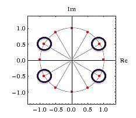

# Roots of unity

This article extends [https://github.com/Z323323/Complex-numbers-background/tree/main].

Wiki reports _"a root of unity is any complex number that yields 1 when raised to some positive integer power n"_.

This means that the roots of unity are the complex solutions to this kind of equations:

$z^{n} = 1$ 
$->$ 
$z = \sqrt[n]{1}$

or equivalently

$z^{n} - 1 = 0$

Solving this kind of equations could enable us to find generators for well defined (we know the order of them, but we don't know the generators until we solve the roots of unity) multiplicative subgroups, which by the way, before approaching this topic, I believed impossible (indeed it's going to be really hard).

## Cyclotomic equations

  The equations mentioned previously are called cyclotomic equations, and it's quite simple to derive the equivalent form

  $x^{n} - 1 = (x - 1)(x^{n - 1} + x^{n - 2} + \dots + 1) = 0$

 Since I basically followed the entire course at [https://crypto.stanford.edu/pbc/notes/numbertheory/] let's follow [https://crypto.stanford.edu/pbc/notes/numbertheory/cyclo.html] for the moment. This section is made for completeness purposes mostly. Solving these kind of equations is in general a challenging math game, so, for the moment, we will find the solutions for $n = 1, 2, 3, 4$ and $5$ using the most elementary methods (such as [https://github.com/Z323323/Quadratic-formula-derivation]). It's possible to find solutions even for $n \gt 5$ but it's hard, and in general the $n = 5$ case already show pretty clearly that the quadratic formula is not the way to go, especially for $n$ $odd$ (we are interested in primes mostly by the way).

 $n = 1$ 
 $->$ 
 $x = 1$

 $---$

 $n = 2$ 
 $->$ 
 $x^{2} = 1$ 
 $->$ 
 $\sqrt{x} = 1$ 
 $->$ 
 $x = \pm 1$ 
 $->$ 
 $x_1 = 1$ 
 $x_2 = - 1$

 $---$

 $n = 3$ 
 $->$ 
 $x^{3} - 1 = 0$ 
 $->$ 
 $(x - 1)(x^{2} + x + 1) = 0$ 
 $->$ 
 $x_1 = 1$ 
 $and$ 
 $\displaystyle x_{2,3} = \frac{- 1 \pm \sqrt{1 - 4}}{2}$ 
 $->$ 
 $\displaystyle x_2 = \frac{- 1 + i\sqrt{3}}{2}$ 
 $\displaystyle x_3 = \frac{- 1 - i\sqrt{3}}{2}$

 $---$

 $n = 4$ 
 $->$ 
 $x^{4} - 1 = 0$ 
 $->$ 
 $(x - 1)(x + 1)(x^{2} + 1) = 0$ 
 $->$ 
 $x_1 = 1$ 
 $x_2 = - 1$ 
 $and$ 
 $x^{2} + 1 = 0$ 
 $->$ 
 $x_{3, 4} = \pm \sqrt{- 1}$ 
 $->$ 
 $x_3 = i$ 
 $x_4 = - i$

 $---$

 $n = 5$ 
 $->$ 
 $x^{5} - 1 = 0$ 
 $->$ 
 $(x - 1)(x^{4} + x^{3} + x^{2} + x + 1) = 0$ 
 $->$ 
 $x_1 = 1$ 
 $and$ 
 $x^{4} + x^{3} + x^{2} + x + 1 = 0$ 
 $->$ 
 $\displaystyle x^{2} + x + 1 + \frac{1}{x} + \frac{1}{x^{2}} = 0$ 
 $->$ 
 $\displaystyle (x + \frac{1}{x})^{2} = x^{2} + 2 + \frac{1}{x^{2}}$ 
 $->$ 
 $\displaystyle x^{2} + x + 1 + \frac{1}{x} + \frac{1}{x^{2}} = (x + \frac{1}{x})^{2} + (x + \frac{1}{x}) - 1$ 
 $->$ 
 $\displaystyle y = x + \frac{1}{x}$ 
 $->$ 
 $\displaystyle (x + \frac{1}{x})^{2} + (x + \frac{1}{x}) - 1 = y^{2} + y - 1 = 0$ 
 $->$ 
 $y^{2} + y - 1 = 0$ 
 $->$ 
 $\displaystyle y_{1,2} = \frac{- 1 \pm \sqrt{5}}{2}$ 
 $->$ 
 $\displaystyle y = x + \frac{1}{x}$ 
 $->$ 
 $\displaystyle yx = x^{2} + 1$ 
 $->$ 
 $\displaystyle x^{2} - yx + 1 = 0$ 
 $->$ 
 $\displaystyle x_{2,3,4,5} = \frac{y \pm \sqrt{y^{2} - 4}}{2} = \frac{\frac{- 1 \pm \sqrt{5}}{2} \pm \sqrt{(\frac{- 1 \pm \sqrt{5}}{2})^{2} - 4}}{2} = \frac{\pm \sqrt{5} - 1}{4} \pm \frac{\sqrt{(\frac{- 1}{2} \pm \frac{\sqrt{5}}{2})^{2} - 4}}{2} = \frac{\pm \sqrt{5} - 1}{4} \pm \frac{\sqrt{\frac{1}{4} \pm (\frac{5}{4} - \frac{\sqrt{5}}{2}) - 4}}{2}$ 
 $\displaystyle x_{2,3} = \frac{\sqrt{5} - 1}{4} \pm \frac{\sqrt{\frac{1}{4} + \frac{5}{4} - \frac{\sqrt{5}}{2} - 4}}{2} = \frac{\sqrt{5} - 1}{4} \pm \frac{\sqrt{\frac{1}{4} + \frac{5}{4} - \frac{2\sqrt{5}}{4} - \frac{16}{4}}}{2} = \frac{\sqrt{5} - 1}{4} \pm \frac{\sqrt{1 + 5 - 2\sqrt{5} - 16}}{4} = \frac{\sqrt{5} - 1 \pm \sqrt{- 2\sqrt{5} - 10}}{4}$ 
 $\displaystyle x_{4,5} = \frac{- \sqrt{5} - 1}{4} \pm \frac{\sqrt{\frac{1}{4} + \frac{5}{4} + \frac{\sqrt{5}}{2} - 4}}{2} = \frac{- \sqrt{5} - 1}{4} \pm \frac{\sqrt{\frac{1}{4} + \frac{5}{4} + \frac{2\sqrt{5}}{4} - \frac{16}{4}}}{2} = \frac{- \sqrt{5} - 1}{4} \pm \frac{\sqrt{1 + 5 + 2\sqrt{5} - 16}}{4} = \frac{- \sqrt{5} - 1 \pm \sqrt{2\sqrt{5} - 10}}{4}$ 
 
If you made it this far you'll agree with me that this is not the way to go to compute roots of unity, even though this is a great exercise. Also, we will need to find a way to make these complex solutions to work on multiplicative groups, since the numbers obtained in complex form still don't help us finding our generators.
  

## Improvement of context, connection with Euler Identity and primitive roots

  Let's set up our new scenario and a couple of definitions.

  We said roots of unity are defined as the solutions of

  $z^{n} = 1$ 

  This means that we have

  $|z|^{n}(\cos(n(\theta + 2k\pi)) + i\sin(n(\theta + 2k\pi))) = 1$

  then

  - $|z|^{n} = 1$
  - - $|z| = 1$ because $|z|$ is obtained only considering the real part of $z$, and the real part gets squared (hence it can't be $- 1$).
  - $\cos(n(\theta + 2k\pi)) + i\sin(n(\theta + 2k\pi)) = 1$
  - - $\cos(n(\theta + 2k\pi)) + i\sin(n(\theta + 2k\pi)) = e^{i2k\pi}$
   
  that is

  $z^{n} = 1 \cdot e^{i2k\pi} = e^{i2k\pi} = 1$

  This means that $z$ is a pure complex number (we already knew it since $|z| = 1$, how?) and finding the roots of unity narrows to

  $\displaystyle \cos(\frac{2k\pi}{n}) + i\sin(\frac{2k\pi}{n}) = e^{\frac{i2k\pi}{n}}$

  for

  $k = \\{0, 1, 2, \dots n - 1\\}$

  and therefore

  $\displaystyle \theta_1 = 0$ 
  $\displaystyle \theta_2 = \frac{2\pi}{n}$ 
  $\displaystyle \theta_3 = \frac{4\pi}{n}$ 
  $\displaystyle \theta_4 = \frac{6\pi}{n}$ 
  $\dots$ 
  $\displaystyle \theta_{n} = \frac{(n - 1)2\pi}{n}$

  Now we can further analyze the previous cases being aware $z^{n} = 1$ is a pure complex number.

  $n = 1$ 
  $->$ 
  $\displaystyle \theta_1 = 0$ 
  $->$ 
  $z_1 = \cos(\theta_1) + i\sin(\theta_1) = \cos(0) + i\sin(0) = 1 + 0 = 1$

  $---$

  $n = 2$ 
  $->$ 
  $\displaystyle \theta_1 = 0$ 
  $\displaystyle \theta_2 = \frac{2\pi}{2} = \pi$ 
  $->$ 
  $z_1 = \cos(\theta_1) + i\sin(\theta_1) = \cos(0) + i\sin(0) = 1$ 
  $z_2 = \cos(\theta_2) + i\sin(\theta_2) = \cos(\pi) + i\sin(\pi) = - 1 + 0 = - 1$

  
  
  $---$

  $n = 3$ 
  $->$ 
  $\displaystyle \theta_1 = 0$ 
  $\displaystyle \theta_2 = \frac{2\pi}{3}$ 
  $\displaystyle \theta_3 = \frac{4\pi}{3}$ 
  $->$ 
  $z_1 = \cos(\theta_1) + i\sin(\theta_1) = \cos(0) + i\sin(0) = 1$ 
  $z_2 = \cos(\theta_2) + i\sin(\theta_2) = \cos(\frac{2\pi}{3}) + i\sin(\frac{2\pi}{3}) = e^{\frac{i2\pi}{3}}$ 
  $z_3 = \cos(\theta_3) + i\sin(\theta_3) = \cos(\frac{4\pi}{3}) + i\sin(\frac{4\pi}{3}) = e^{\frac{i4\pi}{3}}$

  

  $---$

  $n = 4$ 
  $->$ 
  $\displaystyle \theta_1 = 0$ 
  $\displaystyle \theta_2 = \frac{2\pi}{4} = \frac{\pi}{2}$ 
  $\displaystyle \theta_3 = \frac{4\pi}{4} = \pi$ 
  $\displaystyle \theta_4 = \frac{6\pi}{4} = \frac{3\pi}{2}$ 
  $->$ 
  $z_1 = \cos(\theta_1) + i\sin(\theta_1) = \cos(0) + i\sin(0) = 1$ 
  $z_2 = \cos(\theta_2) + i\sin(\theta_2) = \cos(\frac{\pi}{2}) + i\sin(\frac{\pi}{2}) = 0 + i = i$ 
  $z_3 = \cos(\theta_3) + i\sin(\theta_3) = \cos(\pi) + i\sin(\pi) = - 1 + 0 = - 1$ 
  $z_4 = \cos(\theta_4) + i\sin(\theta_4) = \cos(\frac{3\pi}{2}) + i\sin(\frac{3\pi}{2}) = 0 - i = - i$

  

  Now the process should be more than clear. We can abstract $2i\pi$ for a moment and consider only $k$ and $n$ since the former will be constant.

  Now, consider $n_1, n_2$ sharing some cofactor $q$ and $n_2 > n_1$, let

  $n_1 = qx$ 
  $n_2 = qy$

  then consider

  $\displaystyle \frac{k}{qx}$ 
  $and$ 
  $\displaystyle \frac{k}{qy}$
  
  For two different $k$ (which we know they will be verified since $k$ ranges from $0$ to $n_1 - 1$, and $n_2 - 1$) we will necessarily have

  $\displaystyle root_{x + 1} = \frac{1}{q}$ 
  
  for $n_1 = qx$, and
  
  $\displaystyle root_{y + 1} = \frac{1}{q}$
  
  for $n_2 = qy$, where $+ 1$ is because we start at $k = 0$.

  Now, let's set the hypothesis of $q^{2}$ being a cofactor, and $q$ too. We'll have

  $n_1 = q^{2}x$ 
  $n_2 = q^{2}y$ 

  $->$
  
  $\displaystyle root_{x + 1} = \frac{1}{q^{2}}$ 
  $\displaystyle root_{y + 1} = \frac{1}{q^{2}}$ 
  $and$ 
  $\displaystyle root_{xq + 1} = \frac{1}{q}$ 
  $\displaystyle root_{yq + 1} = \frac{1}{q}$

  We define the primitive roots of unity of $n$ as the roots which didn't already appear for some $m < n$. This means that in general, the primitive roots of unity of $n$ are $\phi(n)$, because they (the  non-primitive roots of unity) will have appeared for every $m$ which share some cofactor with $n$. Since we are considering only the numbers $< n$, and the numbers which do not share cofactors with $n$ are coprimes $< n$, the result $\phi(n)$ follows.

  Let's see another example to further clarify $\phi(n)$. Let $n_2 = 12$. We have $1, 2, 3, 4, 6$ which are cofactors, indeed (skipping $n_1 = 1$ and adding $1$ in advance to the result where $\phi(1) = 1$)

  $n_1 = 2$ 
  $n_2 = 12$ 
  $->$ 
  $\displaystyle root_{1 + 1} = \frac{1}{2}$ 
  $\displaystyle root_{6 + 1} = \frac{1}{2}$

  and $\phi(2) = 1$.

  $n_1 = 3$ 
  $n_2 = 12$ 
  $->$ 
  $\displaystyle root_{1 + 1} = \frac{1}{3}$ 
  $\displaystyle root_{4 + 1} = \frac{1}{3}$

  and
 
  $\displaystyle root_{2 + 1} = \frac{2}{3}$ 
  $\displaystyle root_{8 + 1} = \frac{8}{12} = \frac{2}{3}$

  (remember that I'm considering the first root with $k = 0$, this means that the last root won't be $root_{n - 1}$ but $root_{n}$)

  and $\phi(3) = 2$.

  $n_1 = 4$ 
  $n_2 = 12$ 
  $->$ 
  $\displaystyle root_{1 + 1} = \frac{1}{4}$ 
  $\displaystyle root_{3 + 1} = \frac{1}{4}$

  and

  $\displaystyle root_{3 + 1} = \frac{3}{4}$ 
  $\displaystyle root_{9 + 1} = \frac{9}{12} = \frac{3}{4}$

  and $\phi(4) = 2$, because $\phi(2^{2}) = 2^{2} - 2 = 2$.

  $n_1 = 6$ 
  $n_2 = 12$ 
  $->$ 
  $\displaystyle root_{1 + 1} = \frac{1}{6}$ 
  $\displaystyle root_{2 + 1} = \frac{1}{6}$

  and

  $\displaystyle root_{5 + 1} = \frac{5}{6}$ 
  $\displaystyle root_{10 + 1} = \frac{10}{12} = \frac{5}{6}$

  and $\phi(6) = \phi(2)\phi(3) = 2$.

  As you can see, this is a concatenation of reasons which starts at $1$, indeed every number share the first root, then every even will share the $n = 2$ roots, then every number which is multiple of $3$ and $2$ will share the $2$ and $3$ roots, which in turn share the $1$ root, and since the $\phi(n)$ function keeps track of this because it's multiplicative then the result follows.

  We can conclude by seeing that 

  $\phi(12) = \phi(2^{2})\phi(3) = 4$

  and the image below which shows the primitive roots of unity of $n = 12$.

  
  

## Gaussian Periods

  

